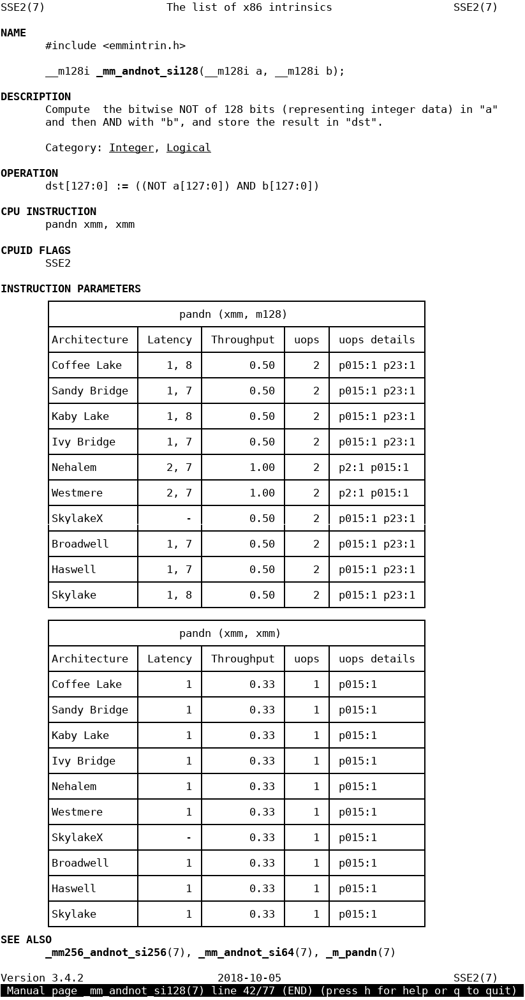

================================================================================
            Manual pages for Intel Intrinsics Guide
================================================================================

.. contents::

Introduction
--------------------------------------------------------------------------------

Intel provides great and well designed site `Intrinsics Guide`__ that gives
a programmer the full list of x86 intrinsics functions. I use the page often,
but there are days when I'm offline and then miss ability to do quick searches.

__ https://software.intel.com/sites/landingpage/IntrinsicsGuide/.

This repository contains a python script which creates a set of Unix manual
pages. It uses data from *Intrinsics Guide* and optionally from `uops.info`__.
The latter provides detailed parameters of CPU instructions (latency,
throughput, port usage) for various Intel architectures.

__ http://uops.info/

Installation
--------------------------------------------------------------------------------

The easiest way to install man pages is build a package suitable for your
system. Building man pages does not require root rights, only installation of
package requires admistrator rights.

The ``MANOPTIONS`` variable sets extra options for script, please read the `next
section <generation_>`_ or run program ``main.py -h``.

There's also `PKGBUILD for Arch`__ prepared by **@pimzero**.

__ https://github.com/pimzero

Building .deb packages
~~~~~~~~~~~~~~~~~~~~~~~~~~~~~~~~~~~~~~~~~~~~~~~~~~

To create a .deb package you need ``dpkg-deb`` program installed.  Then run::

    # optionally set extra options for script
    $ export MANOPTIONS=''
    $ make deb

It will download xml files, create special .deb files (control, postinst,
postrm) and finally build the package ``man-intrinsics-<version>_all.deb``.
You can install it with ``dpkg -i man-intrinsics-<version>_all.deb``.

Building .rpm packages
~~~~~~~~~~~~~~~~~~~~~~~~~~~~~~~~~~~~~~~~~~~~~~~~~~

To create an .rpm package you need ``rpmbuild`` program installed.
Then run::

    # optionally set extra options for script
    $ export MANOPTIONS=''
    $ make rpm

It will download xml files, create a .spec file and finally build the package
``man-intrinsics-<version>-1.noarch.rpm``. 
You can install it with ``man-intrinsics-<version>-1.noarch.rpm``. 

.. _generation:

Manual generation
--------------------------------------------------------------------------------

*Intrinsics Guide* loads a huge XML file, just download that file and feed the
generator. *uops.info* provides a direct link to download their database, also
in XML format. You may use ``make`` to download these .xml files into the
current directory::

    $ make download

Two files should be available: ``data-latest.xml`` (from *Intrinsics Guide*)
and ``instructions.xml`` (from *uops.info*).

Then, to create man pages, you might run either::

    $ ./main.py -g data-latest.xml -o destination-dir

or::

    $ ./main.py -g data-latest.xml -u instructions.xml -o destination-dir

The first invocation creates basic version of man pages (instruction name,
description, etc.), the second one includes also tables with latency,
throughput.

Please run the script ``main.py`` with option ``--help`` to find out more
options; two most important features are described in the following
subsections.

Limiting ISA
~~~~~~~~~~~~~~~~~~~~~~~~~~~~~~~~~~~~~~~~~~~~~~~~~~

**Intrinsics Guide** lists all SIMD (and not only SIMD) instructions. However,
MMX is not used anymore; likewise, KNC wasn't a very widespread technology.

It's possible to select which instructions include or exclude. The option
``--isa`` selects ISA to generate, the option ``--omit-isa`` excludes ISA.
Both can be passed as many times as it's needed and both accept a string,
an ISA symbol, as argument

To obtain the list of meaningful ISA symbols use ``--dump-isa``.

Examples::

    $ ./main.py -g guide.xml --dump-isa
    List of ISAs defined in guide.xml: ..., MMX, ..., SSE, SSE2, ...

    # will generate man pages only for instructions from SSE and SSE2
    $ ./main.py -g guide.xml --isa=SSE --isa=SSE2 -o output-dir

    # will generate man pages for all instructions except MMX
    $ ./main.py -g guide.xml --omit-isa=MMX -o output-dir

Limiting architectures
~~~~~~~~~~~~~~~~~~~~~~~~~~~~~~~~~~~~~~~~~~~~~~~~~~

Database from **uops.info** provides parameters for several architectures,
some of them outdated. It's possible to select which architecture include
(with option ``--arch``) or exclude (with option ``--omit-arch``).
The options can be passed as many times as it's needed, both accept a string,
arch name or symbol.

The list of symbols and names is displayed by option ``--dump-arch``.

Examples::

    # will include details for architectures Haswell, Skylake and SkylakeX
    $ ./main.py -g guide.xml -u uops.xml -o output-dir --arch=HSW --arch=skylake --arch=SkylakeX

    # will exclude details for Westmere
    $ ./main.py -g guide.xml -o output-dir --omit-arch=Westmere

Demo
--------------------------------------------------------------------------------

See also
--------------------------------------------------------------------------------

* https://github.com/Wunkolo/Intriman --- similar project, targeting more
  output formats
* https://github.com/HJLebbink/asm-dude/wiki --- data extracted from the
  official Intel documents
